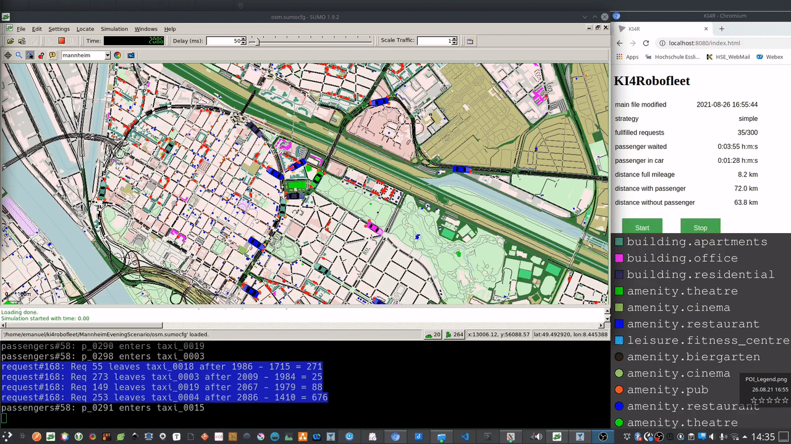

# KI4RoboFleet (SUMO4AV)



#### The KI4RoboFleet (SUMO4AV) is a Simulation Environment based on SUMO to analyze Scenarios for autonomous driving vehicles in Cities

### Link to the Overview-Page: [KI4RoboFleet](https://keim-hs-esslingen.github.io/ki4robofleet/)


### Video Tutorial 

##### [Simulation Demo](https://youtu.be/seKoe6jXcSc)

##### [Overview Video](https://youtu.be/X5AYifgP65g)

##### [Setup a new SUMO Model from scratch using OsmWebWizard](https://youtu.be/Dh_0A-wOk84)

##### [Technical Presentation at the SUMO Conference 2021](https://www.youtube.com/watch?v=Tut2k8K9J5s&list=PLy7t4z5SYNaRIdaznUrlC8F-Vt3qla1GJ&index=11)


### Reqirements to run the Simulation:

- ubuntu 20.04
- Python 3.8.5 or higher
- Eclipse SUMO Version 1.9.0 or higher (Download from https://www.eclipse.org/sumo/)


### SUMO installation:
```bash
sudo add-apt-repository ppa:sumo/stable
sudo apt-get update
sudo apt-get install sumo sumo-tools sumo-doc
```

#### open ~/.bashrc and add following entry (or similar path to your SUMO Installation):
```bash
export SUMO_HOME="/usr/share/sumo"

```


### Some Python Packages need to be installed:

```bash
pip3 install osmapi
pip3 install PyQt5
pip3 install PyQtChart
pip3 install pandas
pip3 install termcolor
sudo apt-get install python3-lxml
```

### The latest SUMO Tools Version has to be installed otherwise routing errors could arise:

```bash
sudo apt-get dist-upgrade
```

### Test the Setup with the provided Scipt to see if SUMO is working properly
```bash
./testRun.sh
```

### Getting Started:

```bash
python KI4RoboFleetUI.py
```

or

```bash
python3 KI4RoboFleetUI.py
```

### During the Simulation the Status is displayed on the Web Interface 
http://localhost:8080/index.html

### Hints:
* The current state of the Project ist still very prototypical and contains still many weak points which easily lead to errors.

* The Manual pages are not up to date and need some rework

* If the following Error arises: DijkstraRouter spent ... answering queries ..." the following bash command may help:
```bash
sudo apt-get dist-upgrade
```

### Setting up your own Model:

* The easiest way is to use the files from the folder "SimpleTestScenario" 
* Replace the osm.poly.xml File with your own file
* Replace the osm.net.xml File with your own file (make sure that your osm.net.xml file contains lanes which allow taxis and lanes which allow pedestrians (sidewalks) at your Points of Interest, otherwise the Points of Interest can not be reached either by pedestrians or by taxis)
* make sure, that you edit the referenceEdge.xml File by entering an edge id (ideally of the center) of you model


