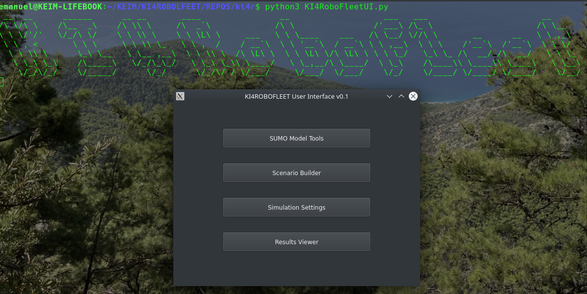
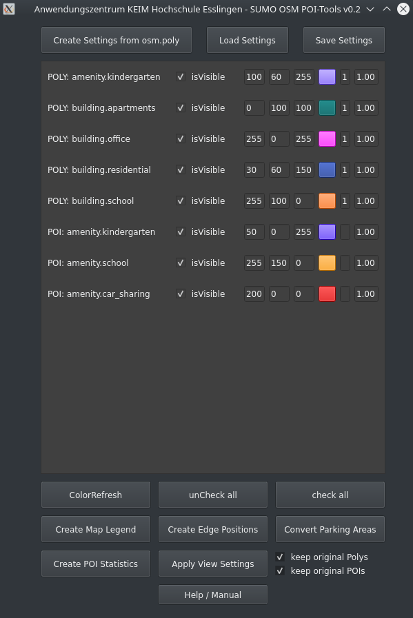
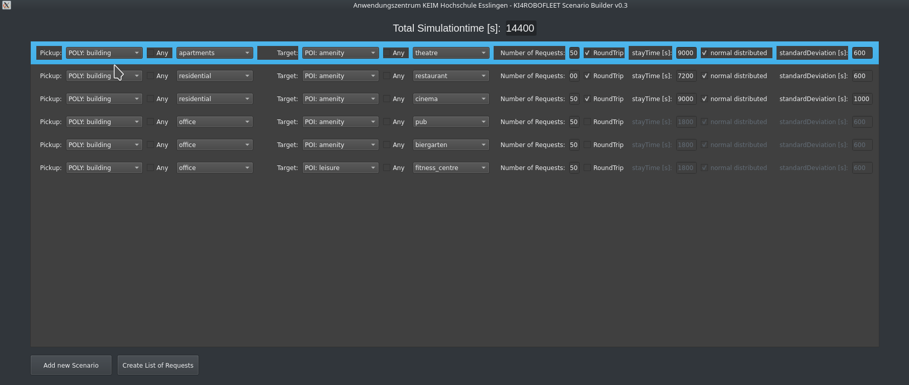
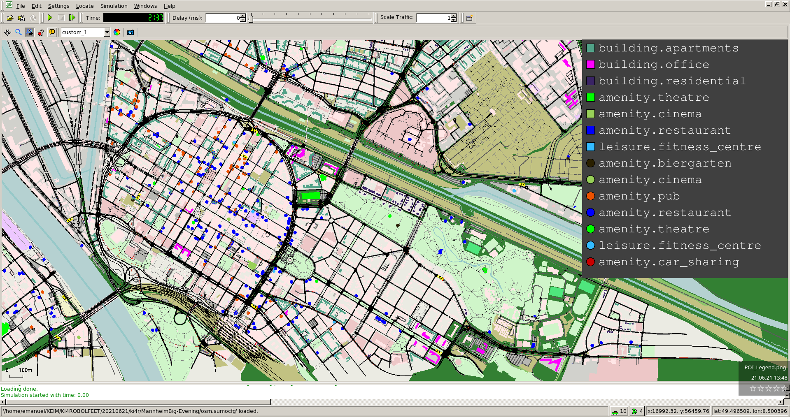
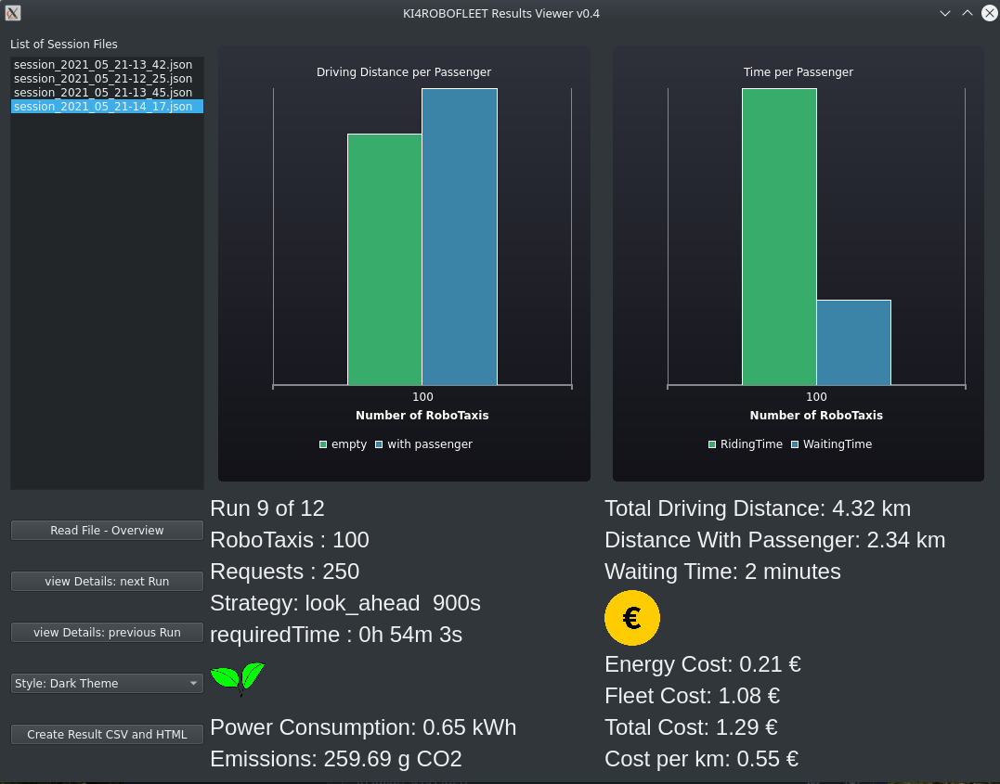

# KI4RoboFleet

## A Simulation Environment based on SUMO to analyze Scenarios for autonomous driving vehicles in Cities

### [Project Page](https://www.keim.iao.fraunhofer.de/de/projekte/KI4ROBOFLEET.html)

## 1. Starting Overview Window:

```bash
python3 KI4RoboFleet.py
```



## 2. Setup the Simulation Model:



## 3. Create Scenarios for the autonomous fleet:



## 4. Run the Simulation



## 5. View the Results


